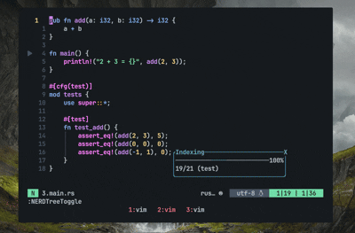
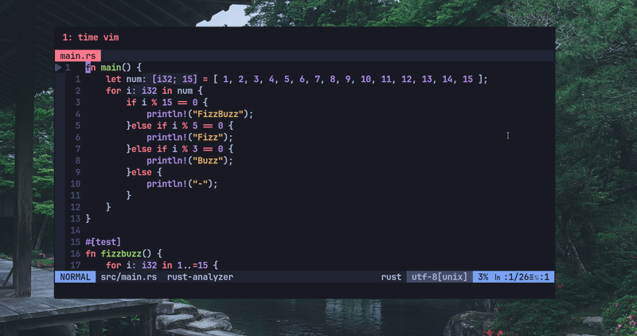
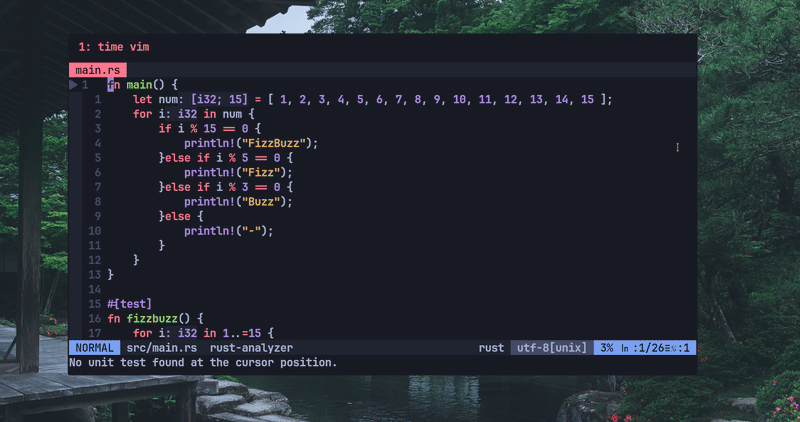
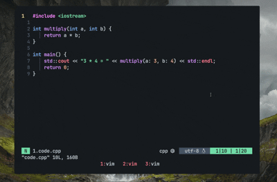
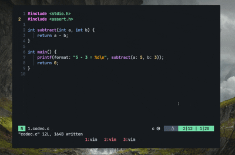
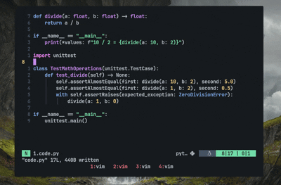
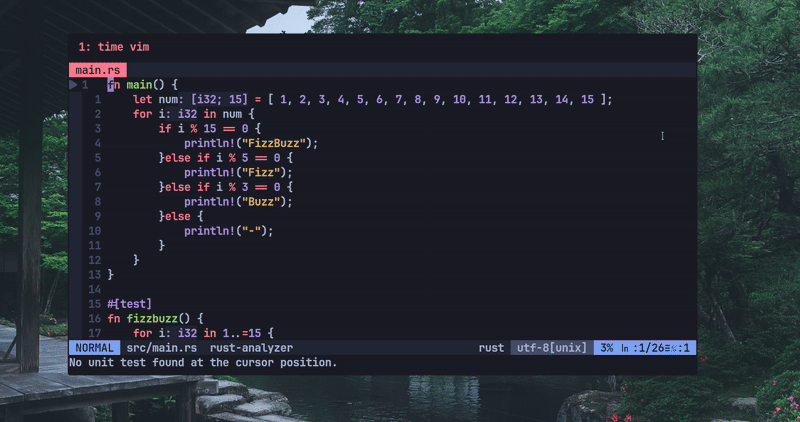

# comvimed
A vim plugin to run Rust main function and unit tests within the file.



## Installation

### Manual Installation

1.  Clone the repository
2.  Copy the directory [comvimed-rust] into 
```
~/.vim/plugged/
```

## Keymaps

You can actually customize the Keymaps inside the plugin folder. The default reads: 

```
nnoremap <silent> <leader>r :call comvimed#RunRust()<CR>

```
<leader>r to run the main function

```
nnoremap <silent> <leader>u :call comvimed#FunctSearch()<CR>
```
<leader>u to search for functions

```
nnoremap <silent> <leader>t :call comvimed#RunRustTests()<CR>
```
<leader>t to run test functions

# Showcase

## Search for functions



## Run main function

### Rust


### C++


### C


### Python


## And many much more languages.

## Run test funtions




